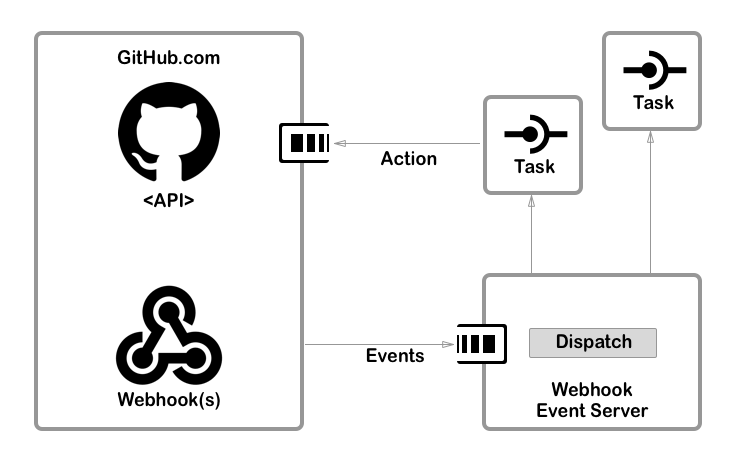

# WebhookEventServer


## This is a 'simple' GitHub Webhook listener application.

The program accepts all incoming GitHub Webhooks events. It evaluates the incoming event and triggers the configured 'action' modules (multiple actions can be associated per Webhook event).

The application can match events to 'actions' based on their type and specific payload content (E.g: github user that is associated with the event)

Events that are not 'registered' in the Yaml config file (no matches found), are being ignored. (see the 'configuration' section for details)



> **Note:** The sample setup in this repository listens for 'Delete Repository' events and creates an 'Issue' in another repository, called 'issue-headRepo'.

## [Install](#install) / [Configure](#configure) / [Run](#run)

## Setup Requirements

 ***This application was developed using Python 2.7.10***

### Create a 'Personal Access Token' in Github

Required to access the GitHub API.

#### Command line Example

```bash
curl https://api.github.com/authorizations \
--user "<user>" \
--data '{"scopes":["headRepo","admin:org","gist","notifications","user"],"note":"MyToken"}'
```

> The JSON response contains a section called,

```json
"token": "0f8...d84"
```

Make sure to store that token! It cannot be retrieved again. (you can always regenerate a token)

#### GitHub Website Example

For creating tokens see,  **[GitHub - Creating a personal access token...](https://help.github.com/articles/creating-a-personal-access-token-for-the-command-line/)**

> Make sure to store the token!

## Create a 'Secret' String for use with GitHub Webhooks

For security reasons, we only accept incoming requests from our GitHub organization !

### Sample Linux command for a secret string

```bash
> uuidgen
C8A1A357-5252-452D-B46D-BF9E325A99D6
```

You can provide any 'string' but we recommend using something similar to the 'uuidgen'.

## Create a Webhook in your GitHub Organization

In your GitHub Organization create a *Webhook* for an event (for testing purposes select all events).

In the Webhook setup (organization/settings/hooks) provide the *secret* string from the previous step. Make sure the Webhook points to the correct location (url) for the Webhook listener (and that it's reachable)

See snap shot of *Webhooks setup section* and *secrets*


___

## Install - The Webhook Listener Server <a id="install"></a>

To install the server, clone this repository and copy all files and subfolders from **src/** to any location where you want to install the application.

### Project folder structure:

```bash
.
├── docs
├── README.md
└── src
    ├── config.yml
    ├── modules
    │   ├── create_issue.py
    │   ├── notification.py
    │   └── template.py
    └── WebhookEventServer.py
```

**NOTE:** the 'modules' folder contains the code for Webhook event actions. To see a sample of how to create a Webhook event action, check 'template.py'.

## Configure - The Webhook Listener Server <a id="configure"></a>

All configuration is done via the 'config.yml' file, found in the 'src/' folder. The application behavior is fully defined by the *config.yml* file.

The config.yml consists of two main parts,

1. **'server'** section, defining all data to run the server
2. **'webhooks'** section, defining all GitHub events and Webhooks for the application to respond

### Sample YAML config

```yaml
server:
  port: 80                              # the port that the application listen for Webhooks
  bind: 0.0.0.0                         # Application bind IP
  log: 'WebhookEventServer.log'         # log file/location
  secret: streng_geheim                 # 'random' string (for incoming Webhook requests)
  # GitHub API request info
  token: f7bb2272b...230c1ed9889        # security token (for Github API calls)
  github_api: 'https://api.github.com'  # GitHub Api endpoint (might be different for on premise)
  owner: jdoe
  organization: jchallenge1

# list the Webhook events that we want to respond to
webhooks:
  # events list from - https://developer.github.com/webhooks/
  - event: issues
    description: 'GitHub Issue created...'
    # the payload_attr acts as a filter option
    payload_attrs:
      - action: opened
    actions:
      - notification

  - event: repository
    description: 'create an issue when a repository gets deleted'
    payload_attrs:
      - action: deleted
    actions:
      - create_issue

  - event: issues
    description: 'GitHub Issue closed...'
    payload_attrs:
      - action: closed
    actions:

```

### Detailed information on the *'webhooks:'* section

 | Parameter | Description |
 |---|---|
 | **- event:** |any event listed in https://developer.github.com/webhooks/ |
 | **payload_attrs:** | Any top level Yaml tag, with it's value can be provided here. |
 | **- action:** opened | The Application will use it as a 'filter' to identify a Webhook event more specifically. For possible attributes check the **'Events API payload'** section from https://developer.github.com/webhooks/ |
 | **actions:** | any number of actions can be provided here as long as it exist in the 'modules' folder|
 |     - create_issue | python file in the 'modules' folder|
 |     - notification | python file in the 'modules' folder|

## Run - The Webhook Listener Server <a id="run"></a>

### Application usage help

```bash
# python WebhookEventServer.py -h
usage: WebhookEventServer.py [-h] [--loglevel LOG_LEVEL]

optional arguments:
  -h, --help            show this help message and exit
  --loglevel LOG_LEVEL, -l LOG_LEVEL
                        LOG_LEVEL: <debug|info|warning|error|critical>
                        (default: INFO)
```

### Run the application

Sample:

```bash
# python WebhookEventServer.py
Start listening on 0.0.0.0:80
```

The server is now listening on port 80 for incoming GitHub Webhook events !<br>
NOTE: Ports below 1024 are 'Privileged Ports' and require 'root' privileges

___

## Some Additional Information

### How to Create an 'Issue' via the GitHub API

#### Command line sample

```bash
curl -d "@./data.json" -u jefeish:cc5...cf75  -X POST https
://api.github.com/repos/jchallenge1/issue-headRepo/issues
```

* -d payload
* -u user:token

### Sample payload 'data.json'

```json
{
  "title": "Found a bug",
  "body": "@user I'm having a problem with this.",
  "assignees": [
    "myuser"
  ],
  "labels": [
    "bug"
  ]
}
```

___

## Requirements for Webhook action implementations

### Sample 'webhook' code template

```python
import requests

global log

# Required class name
class command():

    # initialize the class
    def __init__(self, logger, server_info, payload):
        global log
        # webhook action requires this
        self.server_info = server_info
        self.payload = payload
        log = logger

    # Common entry point
    def execute(self):
        global log
        # Implement action
```
